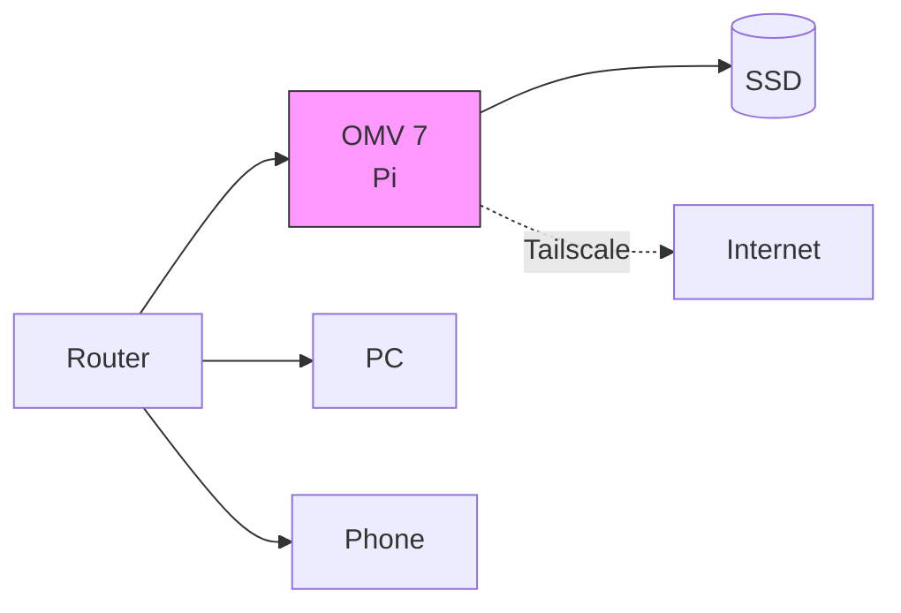
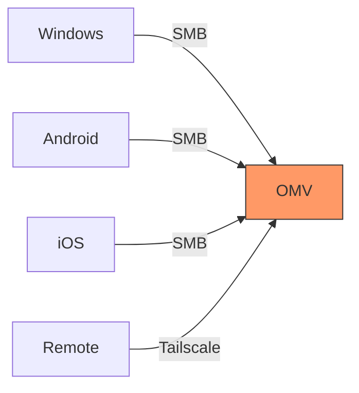
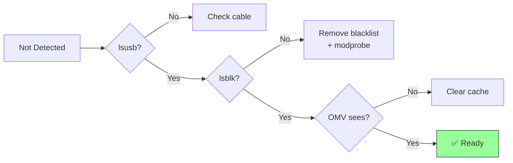

A comprehensive guide for setting up a Raspberry Pi-based home NAS with network shares, mobile access, and remote connectivity.

**Related:** [Pi-hole on OMV 7 with Portainer](/blog/pihole-omv7-portainer) - Add network-wide ad blocking to your server

---

## Table of Contents

1. [Overview](#overview)
2. [Prerequisites](#prerequisites)
3. [Initial OMV 7 Installation](#initial-omv-7-installation)
4. [Troubleshooting: Drive Detection Issues](#troubleshooting-drive-detection-issues)
5. [Samba Network Share Configuration](#samba-network-share-configuration)
6. [Windows Client Connection](#windows-client-connection)
7. [Mobile Device Access](#mobile-device-access)
8. [Remote Access with Tailscale](#remote-access-with-tailscale)
9. [Common Errors & Solutions](#common-errors--solutions)

---

## Overview

This guide walks you through setting up OpenMediaVault 7 on a Raspberry Pi as a home NAS (Network Attached Storage) server. By the end, you'll have:

- A functioning file server accessible from any device on your network
- Mobile access to your files via Android/iOS
- Secure remote access from anywhere in the world

### System Architecture



### Access Methods



**Hardware Used:**
- Raspberry Pi 4/5 (4GB+ RAM recommended)
- 1TB+ external storage (SSD or HDD)
- MicroSD card for OS (32GB+)

---

## Prerequisites

- Raspberry Pi with OMV 7 installed
- External storage connected via USB
- Network connection (Ethernet recommended)
- Admin access to your router

---

## Initial OMV 7 Installation

### Step 1: Flash OMV Image

1. Download the official OMV 7 image for Raspberry Pi
2. Use Raspberry Pi Imager or balenaEtcher to flash to microSD
3. Insert microSD and boot the Pi

### Step 2: Initial Access

```bash
# Find your Pi's IP address from router admin panel
# Or use:
ping raspberrypi.local

# Access web interface
http://YOUR_PI_IP
```

**Default Credentials:**
- Username: `admin`
- Password: `openmediavault`

> **Change the default password immediately** in System → General Settings → Web Administrator Password

---

## Troubleshooting: Drive Detection Issues

### The Problem: "Unknown device /dev/sda: No such device"

After installing or updating OMV 7, you may encounter this error when trying to access Storage → Disks:

```
Failed to execute command 'export PATH=/bin:/sbin:/usr/bin:/usr/sbin:/usr/local/bin:/usr/local/sbin;
export LC_ALL=C.UTF-8; export LANGUAGE=;
udevadm info --query=property --name='/dev/sda' 2>&1' with exit code '1':
Unknown device "/dev/sda": No such device

OMV\ExecException: Failed to execute command...
Stack trace:
#0 /usr/share/php/openmediavault/system/udevtrait.inc(51): OMV\System\Process->execute()
#1 /usr/share/php/openmediavault/system/udevtrait.inc(113): OMV\System\BlockDevice->queryUdevInfo()
...
```

### Root Cause

This typically occurs due to:
1. **Driver blacklisting** - USB storage drivers may be blacklisted
2. **Kernel module issues** - Required modules not loaded
3. **USB power issues** - Insufficient power for external drives

### Troubleshooting Flowchart



### Diagnostic Steps

```bash
# SSH into your Pi
ssh root@YOUR_PI_IP

# Check if drive is detected at hardware level
lsblk

# Check for USB devices
lsusb

# Check kernel messages for drive detection
dmesg | grep -i "sd\|usb\|storage"

# Check if USB storage module is loaded
lsmod | grep usb_storage

# Check for blacklisted modules
cat /etc/modprobe.d/*.conf | grep -i blacklist
```

### Solution 1: Remove Driver Blacklist

```bash
# Check for blacklist entries
grep -r "blacklist usb" /etc/modprobe.d/

# If found, edit the file
sudo nano /etc/modprobe.d/raspi-blacklist.conf

# Comment out or remove these lines if present:
# blacklist usb_storage
# blacklist uas

# Save and exit (Ctrl+X, Y, Enter)

# Reload modules
sudo modprobe usb_storage
sudo modprobe uas

# Reboot
sudo reboot
```

### Solution 2: Force Load USB Storage Modules

```bash
# Add modules to load at boot
echo "usb_storage" | sudo tee -a /etc/modules
echo "uas" | sudo tee -a /etc/modules

# Load immediately
sudo modprobe usb_storage
sudo modprobe uas

# Verify drive appears
lsblk
```

### Solution 3: USB Power Issues

If using a USB HDD/SSD without external power:

```bash
# Check for power-related errors
dmesg | grep -i "over-current\|power"
```

**Fix:** Use a powered USB hub or SSD with lower power requirements.

### Solution 4: Refresh OMV Device Cache

```bash
# Clear OMV's device cache
sudo omv-salt stage run prepare
sudo omv-salt deploy run monit

# Restart OMV engine
sudo systemctl restart openmediavault-engined
```

### Verification

After applying fixes:

```bash
# Verify drive is detected
lsblk

# Should show something like:
# sda      8:0    0 931.5G  0 disk
# └─sda1   8:1    0 931.5G  0 part /srv/dev-disk-by-uuid-xxxxx
```

Then refresh the OMV web interface → Storage → Disks

---

## Samba Network Share Configuration

### Step 1: Install Samba on Pi

```bash
# Update system
sudo apt update && sudo apt upgrade -y

# Install Samba
sudo apt install samba samba-common-bin -y

# Verify installation
smbd --version
```

### Step 2: Create Shared Directory

```bash
# Create share directory
sudo mkdir -p /srv/dev-disk-by-uuid-YOUR-UUID/shared

# Set permissions
sudo chmod 777 /srv/dev-disk-by-uuid-YOUR-UUID/shared
```

### Step 3: Configure Samba

```bash
# Edit Samba configuration
sudo nano /etc/samba/smb.conf
```

Add at the end of the file:

```ini
[SharedFiles]
   path = /srv/dev-disk-by-uuid-YOUR-UUID/shared
   browseable = yes
   writeable = yes
   guest ok = no
   create mask = 0777
   directory mask = 0777
   valid users = YOUR_USERNAME
```

### Step 4: Create Samba User

```bash
# Create Samba password for your user
sudo smbpasswd -a YOUR_USERNAME

# Enter and confirm password when prompted
```

### Step 5: Start Samba Services

```bash
# Enable and start services
sudo systemctl enable smbd nmbd
sudo systemctl start smbd nmbd

# Verify status
sudo systemctl status smbd
```

Expected output:
```
● smbd.service - Samba SMB Daemon
     Loaded: loaded (/lib/systemd/system/smbd.service; enabled; preset: enabled)
     Active: active (running) since ...
     Status: "smbd: ready to serve connections..."
```

---

## Windows Client Connection

### Problem: "Windows cannot find \\RASPBERRYPI"

This error indicates hostname resolution failure.

### Solution 1: Connect via IP Address

```powershell
# Press Win + R
\\192.168.1.X
```

Replace `192.168.1.X` with your Pi's actual IP address.

### Solution 2: Find Pi's IP Address

On the Pi:
```bash
hostname -I
# Output: 192.168.1.238 2401:4900:xxxx:xxxx:xxxx:xxxx:xxxx:xxxx
```

The first address (192.168.1.238) is your IPv4 address.

### Solution 3: Fix Windows Hostname Resolution

**Option A: Add to hosts file**

1. Open Notepad as Administrator
2. Open: `C:\Windows\System32\drivers\etc\hosts`
3. Add line: `192.168.1.X    raspberrypi`
4. Save and close

**Option B: Enable Network Discovery**

1. Settings → Network & Internet → Advanced sharing settings
2. Enable "Network discovery"
3. Enable "File and printer sharing"

### Solution 4: Flush DNS Cache

```powershell
# Run as Administrator
ipconfig /flushdns
nbtstat -R
```

### Connecting Successfully

1. Press `Win + R`
2. Enter: `\\192.168.1.X` or `\\RASPBERRYPI`
3. Enter credentials:
   - Username: `YOUR_USERNAME`
   - Password: Your Samba password

### Removing Duplicate Network Entries

If you see both `RASPBERRYPI` and the IP address in Network:

1. Open `C:\Windows\System32\drivers\etc\hosts` as Administrator
2. Remove the line you added: `192.168.1.X    raspberrypi`
3. Save and restart File Explorer

---

## Mobile Device Access

### Android Setup

**Recommended Apps:**
- Solid Explorer (paid/trial)
- CX File Explorer (free)
- Total Commander with LAN plugin (free)

**Configuration (Solid Explorer example):**

1. Install app from Play Store
2. Menu → Storage → Add → Network Storage
3. Select "SMB/CIFS"
4. Enter:
   - **Host:** `192.168.1.X`
   - **Username:** `YOUR_USERNAME`
   - **Password:** Your Samba password
   - **Share:** Leave blank to see all shares
5. Tap Connect

### iOS Setup

**Using Built-in Files App (iOS 13+):**

1. Open Files app
2. Tap "..." → "Connect to Server"
3. Enter: `smb://192.168.1.X`
4. Tap Connect
5. Select "Registered User"
6. Enter credentials
7. Tap Next

**Alternative Apps:**
- FE File Explorer
- Documents by Readdle

---

## Remote Access with Tailscale

### Why Tailscale?

- Zero-configuration VPN
- Works through firewalls and NAT
- End-to-end encrypted
- Free for personal use
- All platforms supported

> **Never expose SMB (port 445) directly to the internet** - this is a major security risk.

### Step 1: Install Tailscale on Pi

```bash
# Install Tailscale
curl -fsSL https://tailscale.com/install.sh | sh

# Start and authenticate
sudo tailscale up
```

Follow the authentication URL provided.

### Step 2: Get Tailscale IP

```bash
tailscale ip -4
# Output: 100.x.x.x
```

This is your Pi's Tailscale IP address.

### Step 3: Install on Client Devices

1. Download Tailscale app on phone/laptop
2. Sign in with the same account
3. Ensure VPN is connected (check for Tailscale icon)

### Step 4: Connect from Remote Location

**On Android:**
1. Ensure Tailscale is connected
2. Open file manager app
3. Add SMB connection with Tailscale IP:
   - Host: `100.x.x.x`
   - Username/Password: Same as before

**On iOS:**
1. Ensure Tailscale is connected
2. Files app → "..." → "Connect to Server"
3. Enter: `smb://100.x.x.x`

### Step 5: Alternative - Use Hostname

Tailscale often handles hostname resolution automatically:

- Android: `\\raspberrypi`
- iOS: `smb://raspberrypi`

---

## Common Errors & Solutions

### Error: "Access Denied" when connecting

**Cause:** Incorrect credentials or user not in Samba database

**Solution:**
```bash
# Re-add user to Samba
sudo smbpasswd -a YOUR_USERNAME

# Verify user exists
sudo pdbedit -L
```

### Error: "Network path not found"

**Cause:** Samba service not running or firewall blocking

**Solution:**
```bash
# Check Samba status
sudo systemctl status smbd

# Restart if needed
sudo systemctl restart smbd

# Check firewall (if enabled)
sudo ufw allow samba
```

### Error: Slow transfer speeds

**Cause:** Network configuration or Samba settings

**Solution:**
```bash
# Add to [global] section in smb.conf
sudo nano /etc/samba/smb.conf
```

Add:
```ini
[global]
   socket options = TCP_NODELAY IPTOS_LOWDELAY
   read raw = yes
   write raw = yes
   max xmit = 65535
   dead time = 15
   getwd cache = yes
```

### Error: "The specified network name is no longer available"

**Cause:** Connection timeout or network instability

**Solution:**
1. Check Pi network connection
2. Use wired Ethernet instead of WiFi
3. Restart Samba service

### Error: Files visible but can't write

**Cause:** Permission issues

**Solution:**
```bash
# Fix permissions on share directory
sudo chmod -R 777 /path/to/share
sudo chown -R YOUR_USERNAME:YOUR_USERNAME /path/to/share
```

---

## Maintenance & Best Practices

### Regular Updates

```bash
# Update system weekly
sudo apt update && sudo apt upgrade -y

# Update OMV
sudo omv-upgrade
```

### Backup Configuration

```bash
# Backup Samba config
sudo cp /etc/samba/smb.conf /etc/samba/smb.conf.backup

# Backup OMV config
sudo omv-confdbadm export > omv-config-backup.json
```

### Monitor Disk Health

```bash
# Check disk SMART status
sudo smartctl -a /dev/sda

# Check disk usage
df -h
```

### Security Recommendations

1. **Change default passwords** for OMV admin and Pi user
2. **Use strong Samba passwords** (12+ characters, mixed case, numbers, symbols)
3. **Keep system updated** regularly
4. **Use Tailscale** for remote access instead of port forwarding
5. **Enable fail2ban** for SSH protection:
   ```bash
   sudo apt install fail2ban -y
   sudo systemctl enable fail2ban
   ```

---

## Quick Reference

### Key Commands

| Task | Command |
|------|---------|
| Check Samba status | `sudo systemctl status smbd` |
| Restart Samba | `sudo systemctl restart smbd` |
| Find Pi IP | `hostname -I` |
| List connected Samba users | `sudo smbstatus` |
| Check disk detection | `lsblk` |
| View Samba config | `cat /etc/samba/smb.conf` |
| Add Samba user | `sudo smbpasswd -a USERNAME` |
| Get Tailscale IP | `tailscale ip -4` |

### Important File Locations

| File | Location |
|------|----------|
| Samba config | `/etc/samba/smb.conf` |
| Module blacklist | `/etc/modprobe.d/` |
| Hosts file (Windows) | `C:\Windows\System32\drivers\etc\hosts` |
| OMV config | `/etc/openmediavault/config.xml` |

---

## Next Steps

You now have a fully functional home NAS server with:
- Network-attached storage accessible from any device
- Mobile access via Android/iOS apps
- Secure remote access via Tailscale
- Knowledge to troubleshoot common issues

**Next:** Add network-wide ad blocking with [Pi-hole on OMV 7 with Portainer](/blog/pihole-omv7-portainer)

---

*Last Updated: November 2025*
