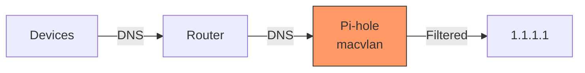
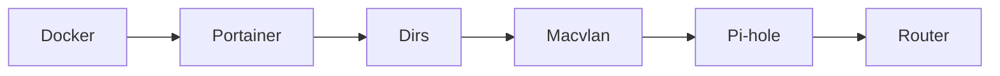
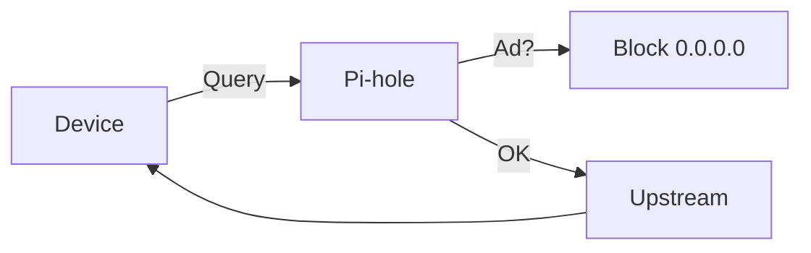
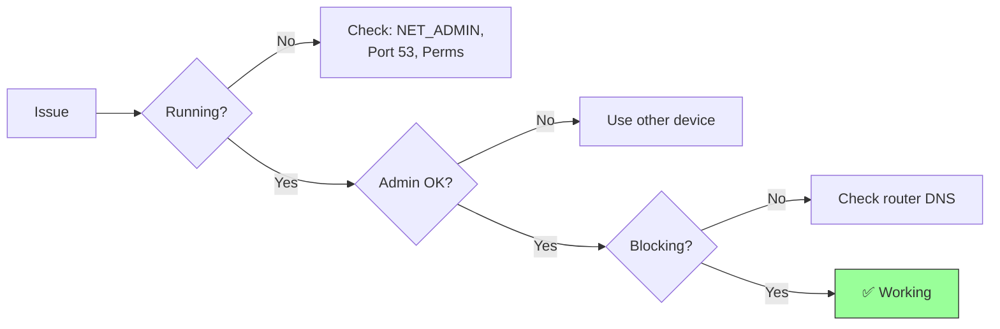

A comprehensive guide for deploying Pi-hole as a network-wide ad blocker in Docker on OMV 7, managed through Portainer.

**Related:** [OMV 7 Home Server Setup](/blog/omv7-homeserver-setup) - Set up your NAS foundation first

---

## Table of Contents

1. [Overview](#overview)
2. [Prerequisites](#prerequisites)
3. [Configuration Values](#configuration-values)
4. [Phase 1: Docker Installation](#phase-1-docker-installation)
5. [Phase 2: Portainer Setup](#phase-2-portainer-setup)
6. [Phase 3: Directory Structure](#phase-3-directory-structure)
7. [Phase 4: Network Configuration](#phase-4-network-configuration)
8. [Phase 5: Pi-hole Container Deployment](#phase-5-pi-hole-container-deployment)
9. [Phase 6: Router Configuration](#phase-6-router-configuration)
10. [Testing & Verification](#testing--verification)
11. [Troubleshooting](#troubleshooting)
12. [Maintenance](#maintenance)

---

## Overview

This guide deploys Pi-hole in a Docker container on your existing OMV 7 installation, using Portainer for container management. The setup uses a macvlan network to give Pi-hole its own IP address, avoiding port conflicts with OMV.

**What You'll Get:**
- Network-wide ad blocking for all devices
- DNS-level filtering (blocks ads before they load)
- Privacy-focused DNS (no Google DNS)
- Easy management through Portainer web UI

**Architecture:**



### Setup Flow



### DNS Query Flow



---

## Prerequisites

- OpenMediaVault 7 installed and running
- SSH access to your server
- Admin access to your router
- Static IP or DHCP reservation for your OMV server

---

## Configuration Values

Before starting, determine your values:

| Parameter | Your Value | Example | Description |
|-----------|------------|---------|-------------|
| `OMV_IP` | __________ | 192.168.1.100 | Your OMV server's IP |
| `GATEWAY` | __________ | 192.168.1.1 | Your router's IP |
| `SUBNET` | __________ | 192.168.1.0/24 | Your network subnet |
| `PIHOLE_IP` | __________ | 192.168.1.200 | Static IP for Pi-hole |
| `TIMEZONE` | __________ | Asia/Kolkata | Your timezone |
| `PIHOLE_PASSWORD` | __________ | (create new) | Pi-hole admin password |

### Timezone Reference

| Region | Timezone Value |
|--------|---------------|
| India | `Asia/Kolkata` |
| US Eastern | `America/New_York` |
| US Pacific | `America/Los_Angeles` |
| UK | `Europe/London` |
| Germany | `Europe/Berlin` |
| Japan | `Asia/Tokyo` |
| Australia Eastern | `Australia/Sydney` |

Full list: https://en.wikipedia.org/wiki/List_of_tz_database_time_zones

### Choosing Pi-hole's IP Address

Your Pi-hole needs a static IP **outside** your router's DHCP range:

**Example Network Setup:**
- Router: 192.168.1.1
- DHCP Range: 192.168.1.100 - 192.168.1.254
- **Pi-hole IP: 192.168.1.10** (outside DHCP range)

> **Important:** Modify your router's DHCP range to leave room for static IPs. Recommended: Set DHCP to start at .100, leaving .2-.99 for static assignments.

---

## Phase 1: Docker Installation

### Step 1: Install OMV-Extras

```bash
# SSH into your OMV server
ssh root@YOUR_OMV_IP

# Download and run OMV-Extras installer
wget -O - https://github.com/OpenMediaVault-Plugin-Developers/packages/raw/master/install | bash
```

### Step 2: Update OMV

In OMV Web UI:
1. Go to **System → Update Management → Updates**
2. Click **Check** then **Install** all updates
3. If kernel updates installed, **reboot**

### Step 3: Install Docker

In OMV Web UI:
1. Go to **System → Plugins**
2. Search for `openmediavault-compose`
3. Select and click **Install**
4. Wait for installation to complete

### Step 4: Verify Docker Installation

```bash
# Check Docker is running
docker --version
docker ps
```

---

## Phase 2: Portainer Setup

### Step 1: Install Portainer Container

```bash
# Create Portainer volume
docker volume create portainer_data

# Deploy Portainer
docker run -d \
  -p 9000:9000 \
  --name=portainer \
  --restart=always \
  -v /var/run/docker.sock:/var/run/docker.sock \
  -v portainer_data:/data \
  portainer/portainer-ce:latest
```

### Step 2: Access Portainer

1. Open browser: `http://YOUR_OMV_IP:9000`
2. Create admin account:
   - Username: `admin`
   - Password: **Create a strong password** (minimum 12 characters)
3. Click **Create user**

### Step 3: Connect to Local Docker

1. Select **Get Started**
2. Click on **local** environment
3. You should see the Docker dashboard

---

## Phase 3: Directory Structure

### Step 1: Identify Your Data Disk

In OMV Web UI:
1. Go to **Storage → File Systems**
2. Note the mount point (e.g., `/srv/dev-disk-by-uuid-xxxxx`)

### Step 2: Create Directory Structure

```bash
# Set your disk path
DISK_PATH="/srv/dev-disk-by-uuid-YOUR-UUID"

# Create Docker directories
sudo mkdir -p ${DISK_PATH}/docker/appdata/pihole-config/pihole
sudo mkdir -p ${DISK_PATH}/docker/appdata/pihole-config/dnsmasq.d

# Set permissions
sudo chown -R 999:999 ${DISK_PATH}/docker/appdata/pihole-config
sudo chmod -R 755 ${DISK_PATH}/docker/appdata/pihole-config
```

### Directory Structure Explanation

```
/srv/dev-disk-by-uuid-xxxxx/
  docker/
    appdata/
      pihole-config/
        pihole/        # Pi-hole configuration & databases
        dnsmasq.d/     # DNS configuration files
```

---

## Phase 4: Network Configuration

### Step 1: Resolve Port 53 Conflict

OMV uses systemd-resolved which occupies port 53. We must disable it:

```bash
# Edit resolved configuration
sudo nano /etc/systemd/resolved.conf
```

Find and modify:
```ini
[Resolve]
DNSStubListener=no
```

Apply changes:
```bash
# Restart systemd-resolved
sudo systemctl restart systemd-resolved

# Verify port 53 is free
sudo ss -tulpn | grep :53
# Should return empty or only show your intended services
```

### Step 2: Determine Network Interface

```bash
# Find your network interface name
ip link show

# Common names:
# - eth0 (traditional)
# - enp0s3 (newer systems)
# - end0 (Raspberry Pi)
```

### Step 3: Create Macvlan Network

The macvlan network gives Pi-hole its own IP address on your network:

```bash
# Replace values with YOUR network configuration
docker network create -d macvlan \
  --subnet=192.168.1.0/24 \
  --gateway=192.168.1.1 \
  --ip-range=192.168.1.200/32 \
  -o parent=eth0 \
  pihole_macvlan
```

**Parameter Explanation:**

| Parameter | Description | Example |
|-----------|-------------|---------|
| `--subnet` | Your network's subnet | `192.168.1.0/24` |
| `--gateway` | Your router's IP | `192.168.1.1` |
| `--ip-range` | IP to assign to Pi-hole | `192.168.1.200/32` |
| `-o parent` | Your network interface | `eth0` or `end0` |

> The `/32` in ip-range means only that single IP will be used

### Step 4: Verify Network Creation

```bash
docker network ls
docker network inspect pihole_macvlan
```

---

## Phase 5: Pi-hole Container Deployment

### Step 1: Open Portainer

Navigate to `http://YOUR_OMV_IP:9000`

### Step 2: Create Container

1. Click **Containers** in left sidebar
2. Click **+ Add container**

### Step 3: Basic Configuration

| Field | Value |
|-------|-------|
| Name | `pihole` |
| Image | `pihole/pihole:latest` |

### Step 4: Network Configuration

1. Scroll to **Network** section
2. Select **pihole_macvlan** from dropdown
3. Under **Advanced container settings → Network**:
   - IPv4 Address: `192.168.1.200` (your chosen Pi-hole IP)

### Step 5: Volume Mappings

Click **+ map additional volume** for each:

| Container Path | Host Path | Type |
|----------------|-----------|------|
| `/etc/pihole` | `/srv/dev-disk-by-uuid-xxxxx/docker/appdata/pihole-config/pihole` | Bind |
| `/etc/dnsmasq.d` | `/srv/dev-disk-by-uuid-xxxxx/docker/appdata/pihole-config/dnsmasq.d` | Bind |

### Step 6: Environment Variables

Scroll to **Env** section. Click **+ add environment variable** for each:

| Name | Value | Description |
|------|-------|-------------|
| `TZ` | `YOUR_TIMEZONE` | e.g., `Asia/Kolkata`, `America/New_York` |
| `WEBPASSWORD` | `YOUR_NEW_PASSWORD` | **Create a NEW password** for Pi-hole admin |
| `SERVERIP` | `192.168.1.200` | Pi-hole's macvlan IP |
| `VIRTUAL_HOST` | `pihole.local` | Optional hostname |
| `PIHOLE_DNS_` | `1.1.1.1;1.0.0.1` | Upstream DNS servers |
| `DNSSEC` | `true` | Enable DNS security |
| `DNSMASQ_LISTENING` | `all` | Listen on all interfaces |

### Privacy-Focused DNS Options

| Provider | Primary | Secondary | Notes |
|----------|---------|-----------|-------|
| Cloudflare | `1.1.1.1` | `1.0.0.1` | Fast, privacy-focused |
| Quad9 | `9.9.9.9` | `149.112.112.112` | Security-focused, blocks malware |
| OpenDNS | `208.67.222.222` | `208.67.220.220` | Family-friendly options available |

> **Password Note:** `WEBPASSWORD` is specifically for Pi-hole's admin interface. Create a unique password - don't reuse your OMV or Portainer passwords.

### Step 7: Capabilities

1. Scroll to **Capabilities** section
2. Find and **enable**: `NET_ADMIN`

> **Critical:** Pi-hole will not function without NET_ADMIN capability

### Step 8: Restart Policy

1. Scroll to **Restart policy**
2. Select: **Unless stopped**

### Step 9: Deploy

1. Click **Deploy the container**
2. Wait for container to start (may take 1-2 minutes first time)

### Step 10: Verify Deployment

```bash
# Check container is running
docker ps | grep pihole

# Check container logs
docker logs pihole

# Test DNS resolution
dig @192.168.1.200 google.com
```

---

## Phase 6: Router Configuration

### Step 1: Access Router Admin

Open your router's admin page (usually `http://192.168.1.1`)

### Step 2: Configure DHCP DNS

Find DHCP settings and set:
- **Primary DNS:** `192.168.1.200` (Pi-hole IP)
- **Secondary DNS:** Leave blank or use `1.1.1.1`

> **Don't set secondary DNS** if you want all queries to go through Pi-hole

### Step 3: Save and Apply

Save settings. Devices will receive new DNS settings when they renew their DHCP lease.

### Step 4: Force DNS Update on Devices

**Windows:**
```powershell
ipconfig /release
ipconfig /renew
ipconfig /flushdns
```

**macOS/Linux:**
```bash
sudo killall -HUP mDNSResponder  # macOS
sudo systemctl restart NetworkManager  # Linux
```

**Mobile:** Toggle WiFi off/on or reconnect to network

---

## Testing & Verification

### Test 1: Pi-hole Admin Access

1. Open: `http://192.168.1.200/admin`
2. Login with password you set in `WEBPASSWORD`
3. Dashboard should show query statistics

### Test 2: DNS Resolution

```bash
# From any device on your network
nslookup google.com 192.168.1.200

# Should return Google's IP addresses
```

### Test 3: Ad Blocking

1. Visit: https://ads-blocker.com/testing/
2. Ads should be blocked
3. Check Pi-hole dashboard for blocked queries

### Test 4: Query Logging

1. Open Pi-hole admin → Query Log
2. Perform some web browsing
3. Queries should appear in real-time

---

## Troubleshooting

### Troubleshooting Flowchart



### Error: "Container starts but immediately stops"

**Check logs:**
```bash
docker logs pihole
```

**Common causes:**

1. **Missing NET_ADMIN capability**
   - Solution: Edit container in Portainer, enable NET_ADMIN

2. **Port 53 conflict**
   - Solution: Ensure `DNSStubListener=no` in `/etc/systemd/resolved.conf`

3. **Permission issues on volumes**
   - Solution:
     ```bash
     sudo chown -R 999:999 /path/to/pihole-config
     sudo chmod -R 755 /path/to/pihole-config
     ```

### Error: "Cannot reach Pi-hole admin page"

**Cause:** Macvlan network isolation

By default, the host cannot communicate with containers on macvlan. This is expected behavior.

**Solution - Create bridge interface:**

```bash
# Create macvlan interface on host
sudo ip link add pihole-shim link eth0 type macvlan mode bridge
sudo ip addr add 192.168.1.201/32 dev pihole-shim
sudo ip link set pihole-shim up
sudo ip route add 192.168.1.200/32 dev pihole-shim

# Make persistent (add to /etc/rc.local or create systemd service)
```

**Alternative:** Access Pi-hole admin from another device on the network

### Error: "DNS queries not being blocked"

1. **Verify Pi-hole is working:**
   ```bash
   dig @192.168.1.200 doubleclick.net
   # Should return 0.0.0.0
   ```

2. **Check device DNS settings:**
   ```bash
   # Windows
   ipconfig /all | findstr "DNS"

   # macOS/Linux
   cat /etc/resolv.conf
   ```

3. **Verify router DHCP is distributing Pi-hole as DNS**

### Error: "Network unreachable" for Pi-hole IP

**Cause:** Macvlan network misconfiguration

**Solutions:**

1. Verify parent interface:
   ```bash
   ip link show
   # Use correct interface name (eth0, end0, enp0s3)
   ```

2. Verify subnet matches your network:
   ```bash
   ip route
   # Check your actual network configuration
   ```

3. Recreate network with correct values:
   ```bash
   docker network rm pihole_macvlan
   docker network create -d macvlan ...
   ```

### Error: "Password incorrect" for Pi-hole admin

**Solution:** Reset password:

```bash
docker exec -it pihole pihole -a -p
# Enter new password when prompted
```

### Slow DNS or Timeouts

1. **Check upstream DNS connectivity:**
   ```bash
   docker exec pihole ping -c 4 1.1.1.1
   ```

2. **Try different upstream DNS:**
   - Edit in Pi-hole admin → Settings → DNS

3. **Check for rate limiting:**
   - Pi-hole admin → Settings → DNS → Rate Limiting

---

## Maintenance

### Updating Pi-hole

**Method 1: Via Portainer**

1. Go to Containers
2. Select `pihole`
3. Click **Recreate** → **Pull latest image**

**Method 2: Via Command Line**

```bash
docker pull pihole/pihole:latest
docker stop pihole
docker rm pihole
# Recreate with same settings (or use docker-compose)
```

### Backing Up Pi-hole

```bash
# Backup configuration
tar -czvf pihole-backup-$(date +%Y%m%d).tar.gz \
  /srv/dev-disk-by-uuid-xxxxx/docker/appdata/pihole-config/

# Backup via Pi-hole (includes lists)
docker exec pihole pihole -a -t
# Creates backup in /etc/pihole/
```

### Viewing Statistics

- **Dashboard:** `http://PI-HOLE-IP/admin`
- **Long-term stats:** Pi-hole admin → Long term data
- **Query log:** Pi-hole admin → Query Log

### Adding Custom Block Lists

1. Pi-hole admin → Group Management → Adlists
2. Add URL of blocklist
3. Update Gravity: Tools → Update Gravity

**Recommended lists:**
- https://raw.githubusercontent.com/StevenBlack/hosts/master/hosts

---

## Quick Reference

### Key Commands

| Task | Command |
|------|---------|
| View Pi-hole logs | `docker logs pihole` |
| Restart Pi-hole | `docker restart pihole` |
| Enter Pi-hole shell | `docker exec -it pihole bash` |
| Update Gravity | `docker exec pihole pihole -g` |
| Reset password | `docker exec pihole pihole -a -p` |
| Check Pi-hole status | `docker exec pihole pihole status` |
| Disable blocking | `docker exec pihole pihole disable` |
| Enable blocking | `docker exec pihole pihole enable` |

### Access Points

| Service | URL |
|---------|-----|
| Pi-hole Admin | `http://PIHOLE_IP/admin` |
| Portainer | `http://OMV_IP:9000` |
| OMV Web UI | `http://OMV_IP` |

### Important File Locations

| File | Location |
|------|----------|
| Pi-hole config | `/srv/.../pihole-config/pihole/` |
| DNS config | `/srv/.../pihole-config/dnsmasq.d/` |
| systemd-resolved | `/etc/systemd/resolved.conf` |

---

## Conclusion

You now have:
- Pi-hole running in Docker on OMV 7
- Portainer for easy container management
- Dedicated IP via macvlan (no port conflicts)
- Privacy-focused DNS (no Google)
- Network-wide ad blocking

**Next Steps:**
- Add custom blocklists for better coverage
- Set up Unbound for recursive DNS (maximum privacy)
- Configure Pi-hole for specific client groups

**Related:** [OMV 7 Home Server Setup](/blog/omv7-homeserver-setup) - Complete NAS setup guide

---

*Last Updated: November 2025*
